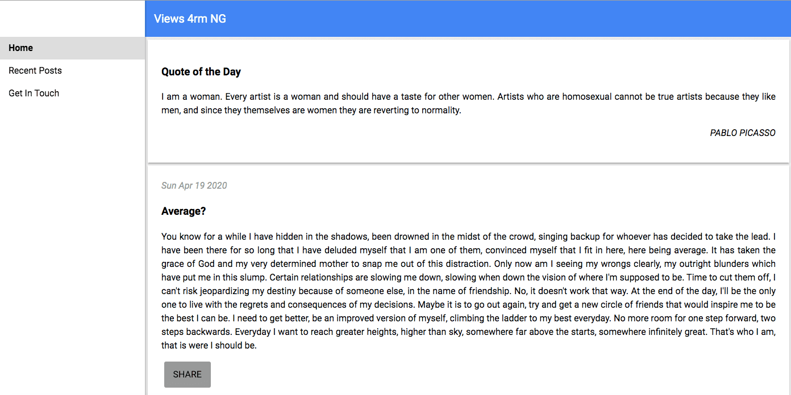
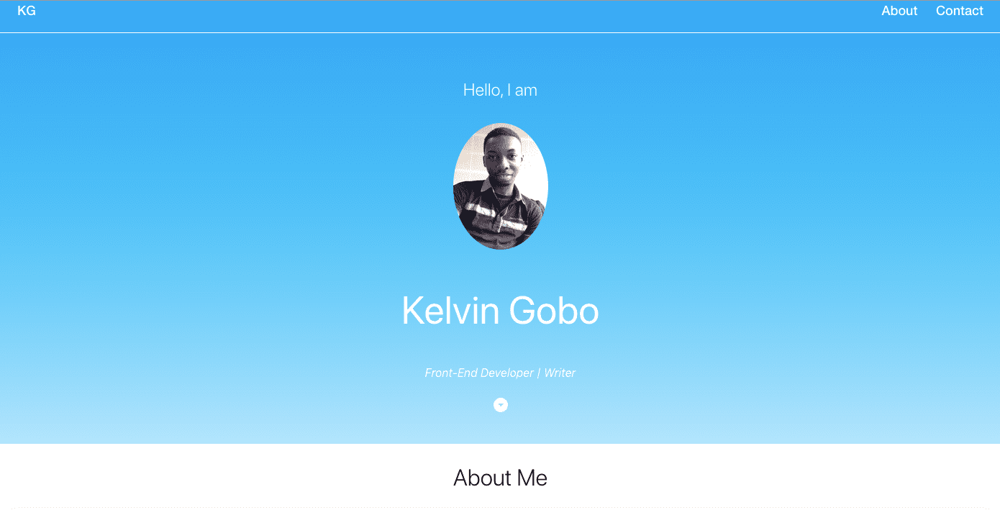
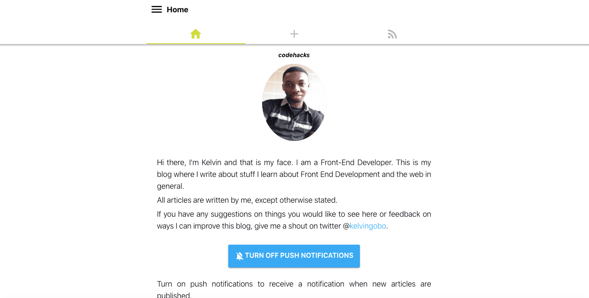
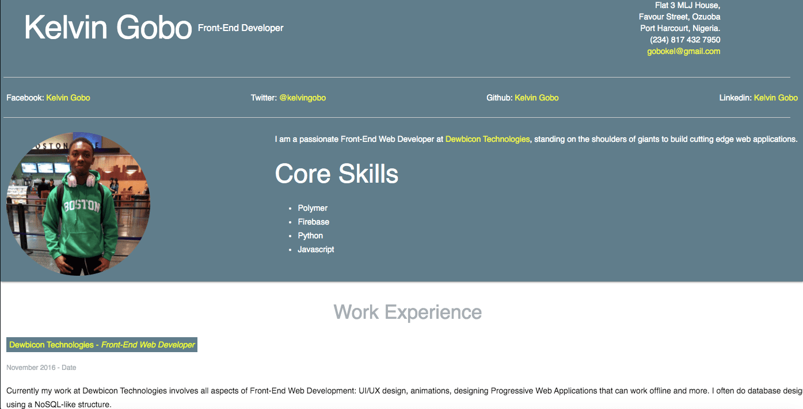
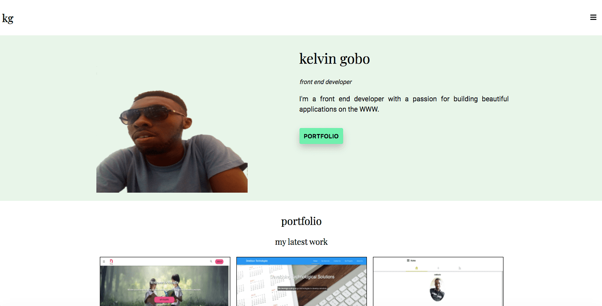
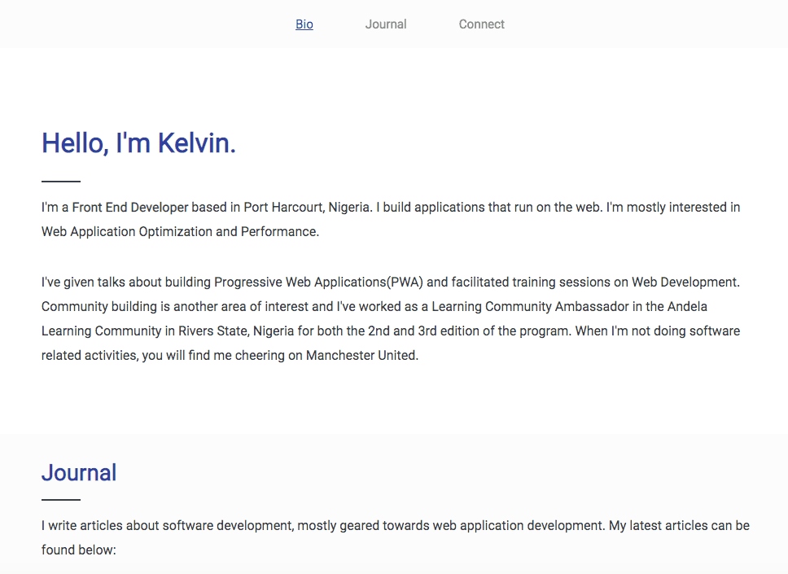
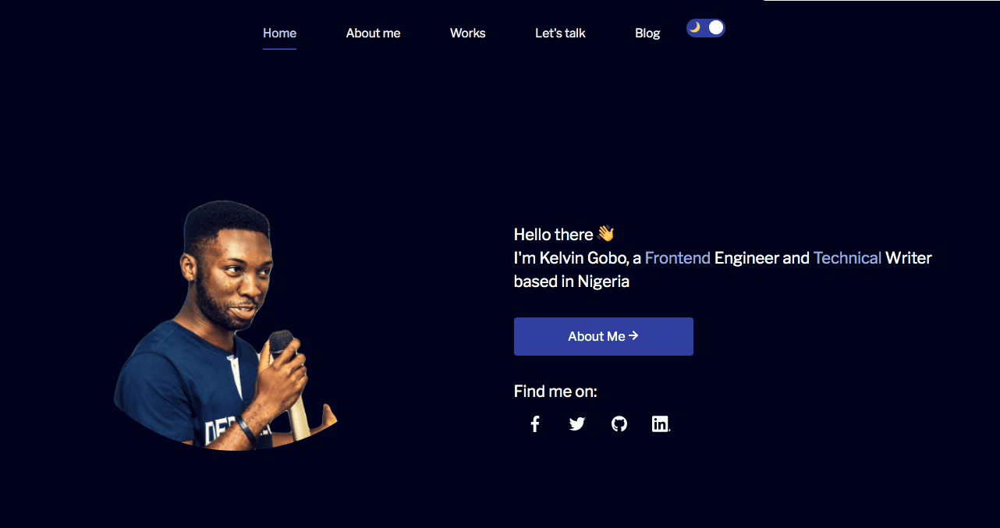

# Portfolio History

A compilation of all my personal portfolio websites

## Version 1

A personal blog which never really saw the light of day

**Last updated**: 19 September, 2016

**Stacks**: HTML5, CSS, JavaScript, Polymer, Firebase

[demo](https://deversespeakspolymer-70f89.web.app/)

## Version 2

My first portfolio site

**Last updated**: 21 August, 2017

**Stacks**: HTML5, CSS, JavaScript, Angular, Firebase

[demo](https://kelvingobo-9b5de.web.app/)

[repo](https://github.com/slightlynerd/kelvin-gobo)

## Version 3

A personal blog. Never got passed the first blog post though.

**Last updated**: 18 November, 2017

**Stacks** HTML5, CSS, JavaScript, Polymer, Firebase

[demo](https://codehacksdottk.web.app/)

## Version 4

Another go at putting together a portfolio

**Last updated**: 8 February, 2018

**Stacks**: HTML5, CSS, Material Design Lite, GitHub Pages

[demo](https://slightlynerd.github.io/mdl-portfolio/) 

[source code](https://github.com/slightlynerd/mdl-portfolio)

## Version 5

A portfolio website showcasing my skills and works

**Last updated**: 7 November, 2018

**Stacks**: HTML5, CSS

[demo](https://slightlynerd.github.io/portfolio/index.html)

[source code](https://github.com/slightlynerd/portfolio)

## Version 6

Portfolio website with blog, contact form, experience and projects worked on

**Last updated**: 26 October, 2019

**Stacks**: HTML5, CSS, JavaScript, Node/express, Firebase

[demo](https://web.archive.org/web/20191026210322/http://www.slightlynerd.com/)

## Current version

Builds on the previous version with new sections and theming

**Stacks**: HTML5, CSS, JavaScript, Node/express, Firebase, Disqus

[demo](http://www.slightlynerd.com/)
